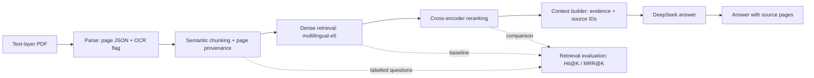

# PDF RAG MVP

A local, traceable question-answering prototype for text-layer PDFs. It parses a
PDF into page-aware JSON, creates provenance-preserving chunks, retrieves
evidence with multilingual dense embeddings, reranks candidates with a
cross-encoder, and asks DeepSeek to generate an answer with source-page
citations.

This repository is intentionally an MVP. Its purpose is to make the retrieval
and answer-generation path inspectable, not to claim support for every PDF
layout or production-scale indexing.

## Pipeline



## Highlights

- Page-level PDF parsing with page metadata carried through to final citations.
- Rule-based semantic chunking with overlap and source-page provenance.
- Multilingual dense retrieval using `intfloat/multilingual-e5-small`.
- Cross-encoder reranking using `cross-encoder/mmarco-mMiniLMv2-L12-H384-v1`.
- Evidence-bounded DeepSeek answers with source IDs and page ranges.
- A Streamlit demo for PDF upload, question answering, and source inspection.
- Manually labelled retrieval evaluation with Hit@K and MRR@K.

## Verified Retrieval Improvement

On a 101-page lecture split into 36 chunks, 10 manually verified questions
were used to compare dense-retrieval ordering with reranked ordering. These are
small controlled results, not a general performance claim for all PDFs.

| Candidate K | Method | Hit@3 | MRR@3 |
| ---: | --- | ---: | ---: |
| 10 | Dense embedding only | 0.70 | 0.60 |
| 10 | Dense embedding + reranking | 0.90 | 0.80 |
| 20 | Dense embedding + reranking | 1.00 | 0.7833 |

See [evals/README.md](evals/README.md) for labelling rules, commands, result
interpretation, and worked examples.

## Supported Scope

| Capability | Status |
| --- | --- |
| Text-layer PDF parsing and page tracking | Supported |
| English and Chinese dense retrieval | Supported |
| Cross-encoder reranking and source citations | Supported |
| Evidence-grounded DeepSeek answer generation | Supported |
| OCR for scanned PDFs and image understanding | Not implemented |
| Structured recovery for complex tables or double-column layouts | Not implemented |
| Persistent vector database or multi-document indexing service | Not implemented; embeddings are computed in memory per document |

## Quick Start: Ask a PDF

1. Install the dependencies:

```bash
python3 -m pip install -r requirements.txt
.venv/bin/python -m pip install -r requirements-semantic.txt
```

2. Create a local API-key file:

```bash
cp .env.example .env
```

Set `DEEPSEEK_API_KEY` in `.env`. The file is ignored by Git and is never
committed.

3. Ask a question in one command:

```bash
.venv/bin/python scripts/ask_pdf.py \
  /path/to/course.pdf \
  "What is the main conclusion of this document?" \
  --candidate-k 20 \
  --top-k 2
```

The command writes `parsed/<pdf-name>.json` and
`chunks/<pdf-name>_chunks.json`, then retrieves, reranks, builds context, and
generates a cited answer. On a first run without local models, add
`--allow-download`.

## Streamlit Demo

The repository also includes a single-page demo for uploading a text-layer PDF,
asking a question, and reviewing source pages and rerank scores. Uploaded files
are processed in a temporary directory and do not write to `parsed/` or
`chunks/`.

```bash
.venv/bin/python -m pip install -r requirements-demo.txt
.venv/bin/python -m streamlit run app.py
```

Open the local URL printed by Streamlit. If the embedding or reranking models
are not available locally yet, enable **Allow first-time model download** in the
sidebar for the initial run.

## Design Decisions

### Why not embed whole pages?

A page can contain definitions, examples, and unrelated material. Embedding the
whole page mixes these meanings, reduces retrieval precision, and places too
much text in the LLM context. This project first forms paragraph- and
sentence-level semantic units, then packs them into target-sized chunks.

### Why preserve page metadata?

A retrieval system should let a user check the source, not only provide an
answer. Every chunk stores `source_pages` and a page range. The context builder
formats these as source labels such as `[S1, pages 1-2]`, which the final answer
can cite.

### Why use dense recall followed by reranking?

Dense embeddings efficiently recall candidates from many chunks, but encode the
query and passage independently. A cross-encoder reads a query and candidate
together, giving a more precise relevance score to a small candidate set.
`candidate-k` is therefore a recall-versus-compute tradeoff: reranking cannot
recover evidence missed by the first stage.

### Why not use TF-IDF as the main retriever?

TF-IDF is a useful baseline and teaching tool, but it relies on lexical overlap
and is sensitive to paraphrases, cross-language queries, and vocabulary gaps.
The main path uses multilingual dense embeddings. TF-IDF experiments remain in
the repository to make those limitations observable.

## Running Individual Stages

### Parse a PDF

```bash
python3 scripts/parse_pdf.py /path/to/course.pdf
```

The default output is `parsed/course.json`. Use `-o` to choose another output
path:

```bash
python3 scripts/parse_pdf.py /path/to/course.pdf -o parsed/course.json
```

The output records document metadata and page-level text:

```json
{
  "schema_version": "0.1.0",
  "source": {
    "path": "/path/to/course.pdf",
    "file_name": "course.pdf",
    "size_bytes": 123456,
    "sha256": "..."
  },
  "document": { "page_count": 10 },
  "pages": [
    {
      "page_index": 0,
      "page_number": 1,
      "char_count": 800,
      "word_count": 320,
      "has_text": true,
      "needs_ocr": false,
      "text": "..."
    }
  ]
}
```

### Create chunks

```bash
python3 scripts/chunk_json.py parsed/course.json
```

The default output is `chunks/course_chunks.json`. Chunks are built from
paragraph and sentence units, then packed to a target length. Page numbers are
provenance metadata, not hard chunk boundaries.

```json
{
  "chunk_id": "course_chunk_0000",
  "text": "A self-contained semantic passage...",
  "source_pages": [1, 2],
  "page_range": "1-2",
  "start_page": 1,
  "end_page": 2,
  "char_count": 760
}
```

### Keyword retrieval baseline

```bash
python3 scripts/search_chunks.py chunks/course_chunks.json "RAG data pipeline"
```

This is a lightweight BM25-style lexical baseline. It returns a chunk ID,
score, source pages, and a snippet. It is not vector retrieval and does not use
an LLM.

### TF-IDF vector experiment

```bash
python3 scripts/vector_search_demo.py \
  chunks/resume2_chunks.json \
  "Has he built an ETL data processing project?"
```

The script converts up to 10 chunks and the query into TF-IDF vectors, computes
cosine similarity locally, and returns the Top-K results with source pages. It
does not use a vector database, Chroma, FAISS, an LLM, or extra Python
dependencies.

To test paraphrases and a synthetic keyword distractor:

```bash
python3 scripts/tfidf_wording_experiment.py chunks/resume2_chunks.json
```

The experiment does not modify the original chunk JSON. It illustrates how
keyword frequency, paraphrasing, and cross-language queries affect TF-IDF.

### Dense semantic retrieval

Install the semantic-retrieval dependencies:

```bash
.venv/bin/python -m pip install -r requirements-semantic.txt
```

Then run dense retrieval:

```bash
.venv/bin/python scripts/semantic_search.py \
  chunks/resume2_chunks.json \
  "Has he built a system that moves and transforms data?"
```

The default model is `intfloat/multilingual-e5-small`. It supports English and
Chinese, creates normalized 384-dimensional vectors, and uses their dot product
as cosine similarity. Models are cached under `.models/`; if a model is not yet
available, use `--allow-download` while connected to the internet.

For a direct comparison with the TF-IDF experiment:

```bash
.venv/bin/python scripts/embedding_wording_experiment.py chunks/resume2_chunks.json
```

### Two-stage reranking

```bash
.venv/bin/python scripts/rerank_search.py \
  chunks/resume2_chunks.json \
  "Has he built a system that moves and transforms data?" \
  --candidate-k 20 \
  --top-k 3
```

The first stage uses `intfloat/multilingual-e5-small` for dense recall. The
second stage uses `cross-encoder/mmarco-mMiniLMv2-L12-H384-v1` to rerank those
candidates. Output includes the rerank score, original embedding rank, and
base similarity. It does not use a vector database or an LLM.

To use a different reranker:

```bash
.venv/bin/python scripts/rerank_search.py \
  chunks/resume2_chunks.json \
  "RAG retrieval optimization" \
  --rerank-model cross-encoder/ms-marco-MiniLM-L6-v2 \
  --allow-download
```

### Build LLM context

```bash
.venv/bin/python scripts/context_builder.py \
  chunks/resume2_chunks.json \
  "What data-processing projects has the candidate completed?" \
  --candidate-k 3 \
  --top-k 3
```

The context contains reranked chunk text, source labels such as `[S1]`, source
pages, rerank scores, and original ranks. Add `--prompt` to print the complete
LLM prompt or `--json` for machine-readable output. Use `--allow-download` on
the initial run when models are not cached locally.

### Generate a DeepSeek answer

```bash
.venv/bin/python scripts/answer_question.py \
  chunks/resume2_chunks.json \
  "What data-processing projects has the candidate completed?" \
  --candidate-k 3 \
  --top-k 1
```

Defaults:

- API base URL: `https://api.deepseek.com`
- Model: `deepseek-v4-flash`
- Thinking: `disabled`
- Evidence: source labels, source pages, and chunk text from `context_builder.py`

Enable reasoning with:

```bash
.venv/bin/python scripts/answer_question.py \
  chunks/resume2_chunks.json \
  "What data-processing projects has the candidate completed?" \
  --candidate-k 3 \
  --top-k 1 \
  --thinking enabled \
  --reasoning-effort high
```

Use `--json` for machine-readable output.

## Retrieval Evaluation

A single answer cannot establish whether reranking actually improves retrieval.
`evaluate_retrieval.py` uses manually labelled questions and relevant chunk IDs
to calculate embedding-only and reranked `Hit@K` and `MRR@K`. It does not call
DeepSeek, so the result is reproducible and has no API cost.

Copy the example and replace its questions and `relevant_chunk_ids` for your
own PDF:

```bash
cp evals/example_retrieval_cases.json evals/my_pdf_cases.json
```

Then run:

```bash
.venv/bin/python scripts/evaluate_retrieval.py \
  chunks/resume2_chunks.json \
  evals/my_pdf_cases.json \
  --candidate-k 3 \
  --top-k 3 \
  --output reports/resume2_retrieval_eval.json
```

`Hit@K` checks whether a relevant chunk appears in the first K results.
`MRR@K` also rewards placing it earlier. Use at least 8-15 questions covering
different document topics before comparing methods.

## Limitations

- Designed for PDFs with an embedded text layer.
- Scanned PDFs may produce little text and are marked `needs_ocr: true`; OCR is
  not implemented.
- Complex double-column layouts and tables are not structurally reconstructed.
- No persistent vector database is used; embeddings are recomputed in memory
  for each PDF.
- The semantic models read at most 512 tokens, so overly long chunks are
  truncated by the model.
